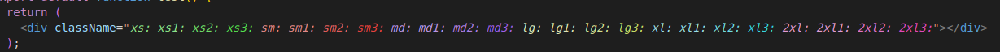
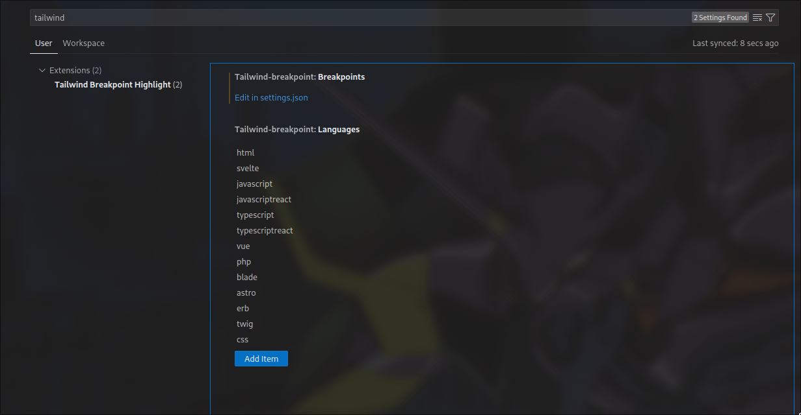

# Tailwind Breakpoint Highlight - `tw-breakpoint`

A tailwind-css inline syntax highlighter to help keep your breakpoints organized!

---

## Features

- Set custom colors and breakpoints (default colors shown below)
- Enable and disable highlighting based on a configurable list of languages



## Customization and Setup

Settings can be found under `Settings` (ctrl+comma) -> `Tailwind Breakpoint Highlight`. The list of languages can be edited in VSCODE directly while breakpoints are edited through `settings.json`.



The default breakpoint configuration format is shown below (edit `breakpoint` and `decoration` to your liking within each breakpoint entry, add new entries to the array where needed.

Note: Additional CSS attributes may be passed into `decoration` (ex: `text-decoration: underline;` should be passed as `"textDecoration": "underline"`) but this has not been tested extensively and as such may cause unexpected behavior.

```json
{
  "tailwind-breakpoint.breakpoints": [
    {
      "breakpoint": "xs",
      "decoration": {
        "color": "#8de188",
        "fontStyle": "italic",
        "fontWeight": "normal"
      }
    },
    {
      "breakpoint": "xs1",
      "decoration": {
        "color": "#8de188",
        "fontStyle": "italic",
        "fontWeight": "normal"
      }
    },
    {
      "breakpoint": "xs2",
      "decoration": {
        "color": "#6edd68",
        "fontStyle": "italic",
        "fontWeight": "normal"
      }
    },
    {
      "breakpoint": "xs3",
      "decoration": {
        "color": "#55de4e",
        "fontStyle": "italic",
        "fontWeight": "normal"
      }
    },
    {
      "breakpoint": "sm",
      "decoration": {
        "color": "#e18988",
        "fontStyle": "italic",
        "fontWeight": "normal"
      }
    },
    {
      "breakpoint": "sm1",
      "decoration": {
        "color": "#e18988",
        "fontStyle": "italic",
        "fontWeight": "normal"
      }
    },
    {
      "breakpoint": "sm2",
      "decoration": {
        "color": "#e55f5c",
        "fontStyle": "italic",
        "fontWeight": "normal"
      }
    },
    {
      "breakpoint": "sm3",
      "decoration": {
        "color": "#e4423f",
        "fontStyle": "italic",
        "fontWeight": "normal"
      }
    },
    {
      "breakpoint": "md",
      "decoration": {
        "color": "#ba96e3",
        "fontStyle": "italic",
        "fontWeight": "normal"
      }
    },
    {
      "breakpoint": "md1",
      "decoration": {
        "color": "#ba96e3",
        "fontStyle": "italic",
        "fontWeight": "normal"
      }
    },
    {
      "breakpoint": "md2",
      "decoration": {
        "color": "#ae7fe4",
        "fontStyle": "italic",
        "fontWeight": "normal"
      }
    },
    {
      "breakpoint": "md3",
      "decoration": {
        "color": "#9e60e6",
        "fontStyle": "italic",
        "fontWeight": "normal"
      }
    },
    {
      "breakpoint": "lg",
      "decoration": {
        "color": "#dbe3b6",
        "fontStyle": "italic",
        "fontWeight": "normal"
      }
    },
    {
      "breakpoint": "lg1",
      "decoration": {
        "color": "#dbe3b6",
        "fontStyle": "italic",
        "fontWeight": "normal"
      }
    },
    {
      "breakpoint": "lg2",
      "decoration": {
        "color": "#d1df92",
        "fontStyle": "italic",
        "fontWeight": "normal"
      }
    },
    {
      "breakpoint": "lg3",
      "decoration": {
        "color": "#c7dc66",
        "fontStyle": "italic",
        "fontWeight": "normal"
      }
    },
    {
      "breakpoint": "2xl",
      "decoration": {
        "color": "#e39cd2",
        "fontStyle": "italic",
        "fontWeight": "normal"
      }
    },
    {
      "breakpoint": "2xl1",
      "decoration": {
        "color": "#e39cd2",
        "fontStyle": "italic",
        "fontWeight": "normal"
      }
    },
    {
      "breakpoint": "2xl2",
      "decoration": {
        "color": "#e074c7",
        "fontStyle": "italic",
        "fontWeight": "normal"
      }
    },
    {
      "breakpoint": "2xl3",
      "decoration": {
        "color": "#e049bd",
        "fontStyle": "italic",
        "fontWeight": "normal"
      }
    },
    {
      "breakpoint": "xl",
      "decoration": {
        "color": "#9ddee3",
        "fontStyle": "italic",
        "fontWeight": "normal"
      }
    },
    {
      "breakpoint": "xl1",
      "decoration": {
        "color": "#9ddee3",
        "fontStyle": "italic",
        "fontWeight": "normal"
      }
    },
    {
      "breakpoint": "xl2",
      "decoration": {
        "color": "#71dbe3",
        "fontStyle": "italic",
        "fontWeight": "normal"
      }
    },
    {
      "breakpoint": "xl3",
      "decoration": {
        "color": "#36d5e0",
        "fontStyle": "italic",
        "fontWeight": "normal"
      }
    }
  ]
}
```

## Extension Settings

This extension contributes the following settings:

- `tailwind-breakpoint.languages`: A list of languages to which breakpoint highlighting should be applied.
- `tailwind-breakpoint.breakpoints`: A list of breakpoint objects which include fontStyle, fontWeight, and color. (Other CSS attributes may function but users may experience undefined behavior.)
