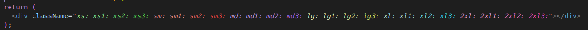

# tw-breakpoint

tw-breakpoint is a tailwind-css inline syntax highlighter to help keep your breakpoints organized!

---

## Features

- Set up to 20 color tags for inline tailwind-css in .tsx, .jsx, .ts, and .js files: (default colors are shown below)



## Customization and Setup

### Setup:

mix and match any of the following screen `key, value pairs` in your `tailwind.config.js` file:

```javascript
module.exports = {
  content: [
    "./pages/**/*.{js,ts,jsx,tsx}",
    "./components/**/*.{js,ts,jsx,tsx}",
  ],
  theme: {
    screens: {
      xs: "320px",
      xs1: "400px",
      xs2: "500px",
      xs3: "550px",
      sm: "640px",
      sm1: "680px",
      sm2: "700px",
      sm3: "720px",
      md: "768px",
      md1: "820px",
      md2: "900px",
      md3: "980px",
      lg: "1024px",
      lg1: "1100px",
      lg2: "1150px",
      lg3: "1200px",
      xl: "1280px",
      xl1: "1500px",
      xl2: "2200px",
      xl3: "3600px",
    },
  },

  ... other config
};
```

### Customize each color by adding to `editor.tokenColorCustomizations` in user settings.

#### The format is as follows (edit `foreground` and `fontStyle` to your liking, CUSTOM SCOPES WILL NOT WORK):

```json
"editor.tokenColorCustomizations": {

        "textMateRules": [
          {
            "scope": "twbreak.xs",
            "settings": {
              "foreground": "#8de188",
              "fontStyle": "italic"
            }
          },
          {
            "scope": "twbreak.xs1",
            "settings": {
              "foreground": "#8de188",
              "fontStyle": "italic"
            }
          },
          {
            "scope": "twbreak.xs2",
            "settings": {
              "foreground": "#6edd68",
              "fontStyle": "italic"
            }
          },
          {
            "scope": "twbreak.xs3",
            "settings": {
              "foreground": "#55de4e",
              "fontStyle": "italic"
            }
          },
          {
            "scope": "twbreak.sm",
            "settings": {
              "foreground": "#e18988",
              "fontStyle": "italic"
            }
          },
          {
            "scope": "twbreak.sm1",
            "settings": {
              "foreground": "#e18988",
              "fontStyle": "italic"
            }
          },
          {
            "scope": "twbreak.sm2",
            "settings": {
              "foreground": "#e55f5c",
              "fontStyle": "italic"
            }
          },
          {
            "scope": "twbreak.sm3",
            "settings": {
              "foreground": "#e4423f",
              "fontStyle": "italic"
            }
          },
          {
            "scope": "twbreak.md",
            "settings": {
              "foreground": "#ba96e3",
              "fontStyle": "italic"
            }
          },
          {
            "scope": "twbreak.md1",
            "settings": {
              "foreground": "#ba96e3",
              "fontStyle": "italic"
            }
          },
          {
            "scope": "twbreak.md2",
            "settings": {
              "foreground": "#ae7fe4",
              "fontStyle": "italic"
            }
          },
          {
            "scope": "twbreak.md3",
            "settings": {
              "foreground": "#9e60e6",
              "fontStyle": "italic"
            }
          },
          {
            "scope": "twbreak.lg",
            "settings": {
              "foreground": "#dbe3b6",
              "fontStyle": "italic"
            }
          },
          {
            "scope": "twbreak.lg1",
            "settings": {
              "foreground": "#dbe3b6",
              "fontStyle": "italic"
            }
          },
          {
            "scope": "twbreak.lg2",
            "settings": {
              "foreground": "#d1df92",
              "fontStyle": "italic"
            }
          },
          {
            "scope": "twbreak.lg3",
            "settings": {
              "foreground": "#c7dc66",
              "fontStyle": "italic"
            }
          },
          {
            "scope": "twbreak.xl",
            "settings": {
              "foreground": "#9ddee3",
              "fontStyle": "italic"
            }
          },
          {
            "scope": "twbreak.xl1",
            "settings": {
              "foreground": "#9ddee3",
              "fontStyle": "italic"
            }
          },
          {
            "scope": "twbreak.xl2",
            "settings": {
              "foreground": "#71dbe3",
              "fontStyle": "italic"
            }
          },
          {
            "scope": "twbreak.xl3",
            "settings": {
              "foreground": "#36d5e0",
              "fontStyle": "italic"
            }
          }
        ]
      }
```

## Extension Settings

Include if your extension adds any VS Code settings through the `contributes.configuration` extension point.

For example:

This extension contributes the following settings:

- `tw-breakpoint.enable`: Enable/disable this extension.
- `editor.tokenColorCustomizations`: defaults are set to specific colors for each size.

---

## Known Issues

## Release Notes

### 0.0.1

Initial release of tw-breakpoint! Thanks for using this extension <3

---
